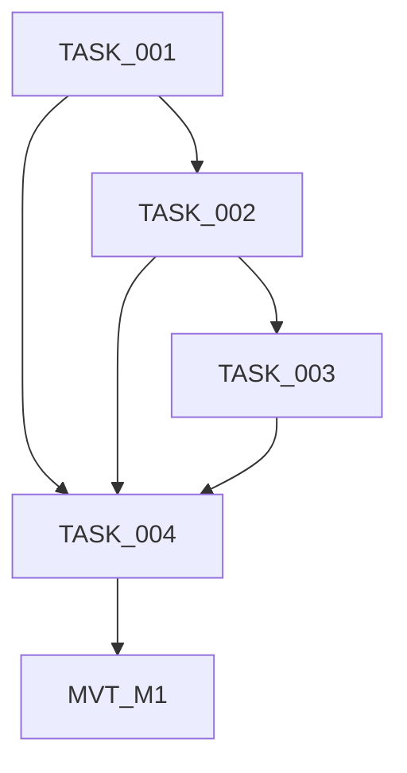
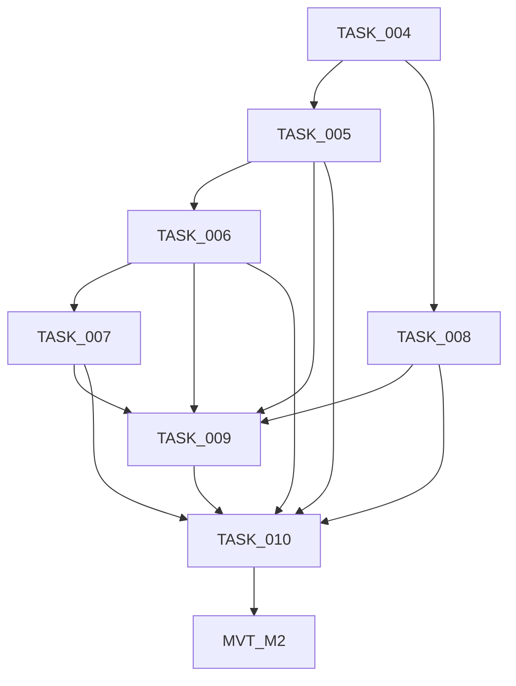
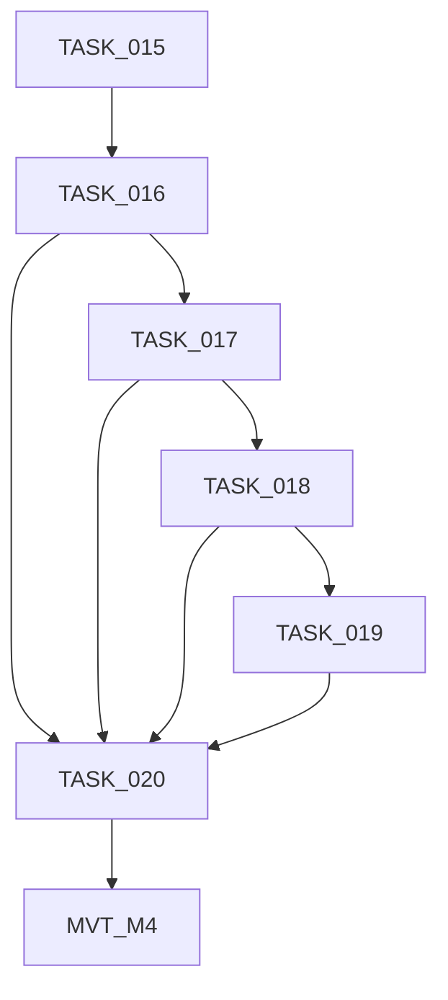

# Docs-Site Performance & Design Refresh - Implementation Progress

## Overview

| Property | Value |
| --- | --- |
| **Project Name** | Docs-Site Performance & Design Refresh |
| **Plan File** | `docs/docs-site-performance-and-design-refresh_implementation_plan.md` |
| **Scope** | `docs-site/` only |
| **Total Tasks** | 20 tasks + 4 MVTs |
| **Tech Stack** | Stati, Eta, TypeScript, Tailwind CSS, esbuild |

## Status Legend

| Marker | Meaning |
| --- | --- |
| COMPLETE | Task finished and verified |
| IN PROGRESS | Currently being worked on |
| IN REVIEW | Work complete, awaiting review |
| NOT STARTED | Task not yet begun |
| BLOCKED | Waiting on dependency completion |

## Progress Summary

| Milestone | Name | Tasks | MVT | Complete | Total | Status |
| --- | --- | --- | --- | --- | --- | --- |
| M1 | Foundation and Design System | 001-004 | MVT_M1 | 0 | 5 | NOT STARTED |
| M2 | Composed Editorial Experience | 005-010 | MVT_M2 | 0 | 7 | NOT STARTED |
| M3 | Runtime Performance and Motion | 011-015 | MVT_M3 | 0 | 6 | NOT STARTED |
| M4 | Verification and Handoff | 016-020 | MVT_M4 | 0 | 6 | NOT STARTED |

## Milestone: M1 - Foundation and Design System

| Task ID | Title | File | Status | Review Status | Priority | Complexity | Dependencies |
| --- | --- | --- | --- | --- | --- | --- | --- |
| TASK_001 | Capture Reproducible Baseline | `TASK_001_capture_reproducible_baseline.md` | NOT STARTED | — | HIGH | S | None |
| TASK_002 | Build Intentional Font Pipeline | `TASK_002_build_intentional_font_pipeline.md` | NOT STARTED | — | HIGH | M | TASK_001 |
| TASK_003 | Establish Tokens, Type, and Syntax System | `TASK_003_establish_tokens_type_and_syntax_system.md` | NOT STARTED | — | HIGH | L | TASK_002 |
| TASK_004 | Integrate and Validate Foundation | `TASK_004_integrate_and_validate_foundation.md` | NOT STARTED | — | HIGH | M | TASK_001, TASK_002, TASK_003 |
| MVT_M1 | Foundation and Design System Manual Test | `MVT_M1_foundation_and_design_system.md` | NOT STARTED | — | — | 35 min | TASK_001-TASK_004 |

## Milestone: M2 - Composed Editorial Experience

| Task ID | Title | File | Status | Review Status | Priority | Complexity | Dependencies |
| --- | --- | --- | --- | --- | --- | --- | --- |
| TASK_005 | Build Source/Output Hero | `TASK_005_build_source_output_hero.md` | NOT STARTED | — | HIGH | L | TASK_004 |
| TASK_006 | Build Path and Capability Map | `TASK_006_build_path_and_capability_map.md` | NOT STARTED | — | HIGH | L | TASK_005 |
| TASK_007 | Build Proof Desk and Command Close | `TASK_007_build_proof_desk_and_command_close.md` | NOT STARTED | — | HIGH | L | TASK_006 |
| TASK_008 | Polish Documentation Chrome | `TASK_008_polish_documentation_chrome.md` | NOT STARTED | — | HIGH | L | TASK_004 |
| TASK_009 | Apply Motion and CSS Discipline | `TASK_009_apply_motion_and_css_discipline.md` | NOT STARTED | — | HIGH | M | TASK_005-TASK_008 |
| TASK_010 | Integrate Homepage and Chrome | `TASK_010_integrate_homepage_and_chrome.md` | NOT STARTED | — | HIGH | M | TASK_005-TASK_009 |
| MVT_M2 | Composed Editorial Experience Manual Test | `MVT_M2_composed_editorial_experience.md` | NOT STARTED | — | — | 60 min | TASK_005-TASK_010 |

## Milestone: M3 - Runtime Performance and Motion

| Task ID | Title | File | Status | Review Status | Priority | Complexity | Dependencies |
| --- | --- | --- | --- | --- | --- | --- | --- |
| TASK_011 | Remove tsParticles | `TASK_011_remove_tsparticles.md` | NOT STARTED | — | HIGH | M | TASK_010 |
| TASK_012 | Add Typed Idle Scheduler | `TASK_012_add_typed_idle_scheduler.md` | NOT STARTED | — | MEDIUM | S | TASK_011 |
| TASK_013 | Defer Non-Critical Docs Initialization | `TASK_013_defer_noncritical_docs_initialization.md` | NOT STARTED | — | MEDIUM | S | TASK_012 |
| TASK_014 | Add Live Reduced-Motion Behavior | `TASK_014_add_live_reduced_motion_behavior.md` | NOT STARTED | — | HIGH | M | TASK_013 |
| TASK_015 | Integrate Route Bundles and Runtime | `TASK_015_integrate_route_bundles_and_runtime.md` | NOT STARTED | — | HIGH | M | TASK_011-TASK_014 |
| MVT_M3 | Runtime Performance and Motion Manual Test | `MVT_M3_runtime_performance_and_motion.md` | NOT STARTED | — | — | 45 min | TASK_011-TASK_015 |

## Milestone: M4 - Verification and Handoff

| Task ID | Title | File | Status | Review Status | Priority | Complexity | Dependencies |
| --- | --- | --- | --- | --- | --- | --- | --- |
| TASK_016 | Clean Build Artifact Hygiene | `TASK_016_clean_build_artifact_hygiene.md` | NOT STARTED | — | HIGH | S | TASK_015 |
| TASK_017 | Execute Full QA and Design Preflight | `TASK_017_execute_full_qa_and_design_preflight.md` | NOT STARTED | — | HIGH | L | TASK_016 |
| TASK_018 | Remeasure Performance Budgets | `TASK_018_remeasure_performance_budgets.md` | NOT STARTED | — | HIGH | M | TASK_001, TASK_016, TASK_017 |
| TASK_019 | Document Design and Performance Decisions | `TASK_019_document_design_and_performance_decisions.md` | NOT STARTED | — | MEDIUM | M | TASK_017, TASK_018 |
| TASK_020 | Integrate Release Acceptance and Handoff | `TASK_020_integrate_release_acceptance_and_handoff.md` | NOT STARTED | — | HIGH | M | TASK_016-TASK_019 |
| MVT_M4 | Verification and Handoff Manual Test | `MVT_M4_verification_and_handoff.md` | NOT STARTED | — | — | 75 min | TASK_016-TASK_020 |

## Completed Milestones

None yet.

## Critical Path

`TASK_001 → TASK_002 → TASK_003 → TASK_004 → TASK_005 → TASK_006 → TASK_007 → TASK_009 → TASK_010 → TASK_011 → TASK_012 → TASK_013 → TASK_014 → TASK_015 → TASK_016 → TASK_017 → TASK_018 → TASK_019 → TASK_020 → MVT_M4`

## Risk Areas

| Task | Risk | Mitigation |
| --- | --- | --- |
| TASK_002 | Font provenance or metric shift | Official asset/license, fallback metrics, slow-font CLS QA |
| TASK_009 | Purging a live class | Audit generated HTML/runtime strings before removal |
| TASK_011 | Stale particle import/dependency | Remove leaf-to-entry-to-lockfile and inspect built output |
| TASK_014 | Browser listener differences | Feature detection, cleanup, and fallback tests |
| TASK_018 | Variable performance data | Fixed five-run median methodology from TASK_001 |

## Subagent Tracking

Last Subagent ID: SA-FINAL-20260713-001

## Agent Handoff

| Field | Value |
| --- | --- |
| Task | — |
| Impl Agent | — |
| Files Changed | — |
| Tests Added | — |
| Focus Areas | — |
